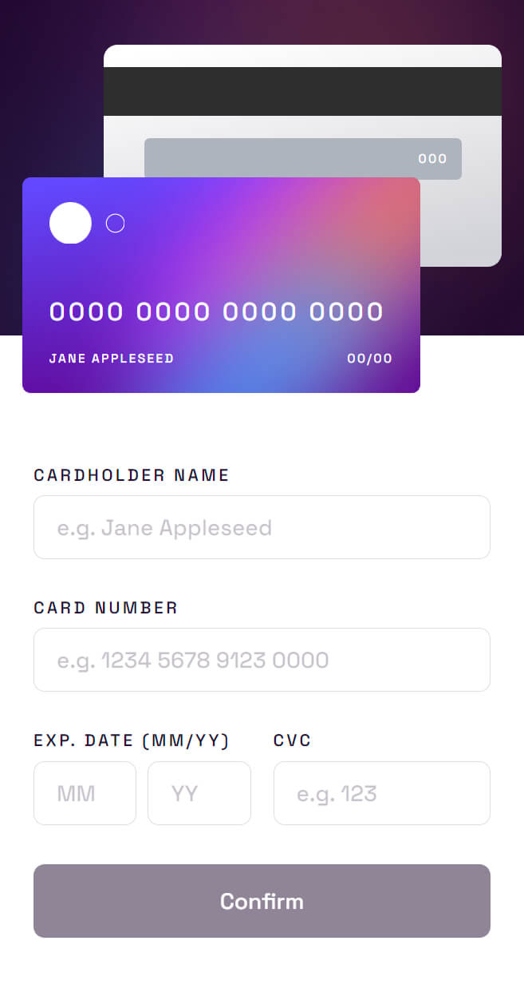
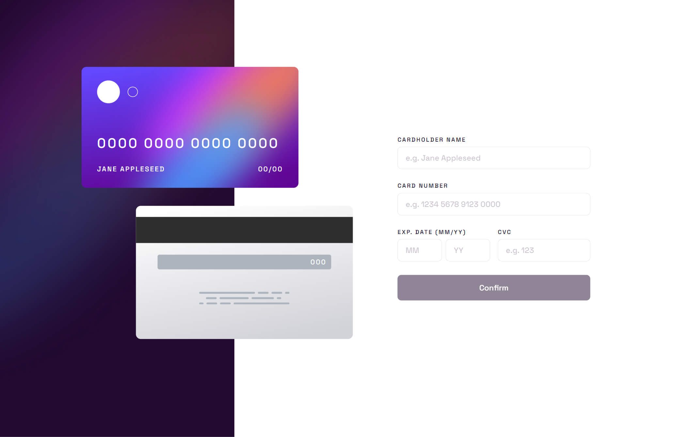

# Frontend Mentor - Interactive card details form solution

This is a solution to the [Interactive card details form challenge on Frontend Mentor](https://www.frontendmentor.io/challenges/interactive-card-details-form-XpS8cKZDWw). Frontend Mentor challenges help you improve your coding skills by building realistic projects. 

## Table of contents

- [Overview](#overview)
  - [The challenge](#the-challenge)
  - [Screenshot](#screenshot)
  - [Links](#links)
- [My process](#my-process)
  - [Built with](#built-with)
  - [What I learned](#what-i-learned)
- [Author](#author)

## Overview

### The challenge

Users should be able to:

- Fill in the form and see the card details update in real-time
- Receive error messages when the form is submitted if:
  - Any input field is empty
  - The card number, expiry date, or CVC fields are in the wrong format
- View the optimal layout depending on their device's screen size
- See hover, active, and focus states for interactive elements on the page

### Screenshot

### Links

- Solution URL: [https://www.frontendmentor.io/solutions/interactive-card-details-form-solution-with-svelte-M3HKx-h1K-](https://www.frontendmentor.io/solutions/interactive-card-details-form-solution-with-svelte-M3HKx-h1K-)
- Live Site URL: [https://interactive-card-details-form-svelte-viniciuscosta89.vercel.app/](https://interactive-card-details-form-svelte-viniciuscosta89.vercel.app/)

## My process

### Built with

- Semantic HTML5 markup
- CSS custom properties
- Flexbox
- CSS Grid
- Mobile-first workflow
- [Project IDX](https://idx.dev/) - An experimental, web-based, integrated development environment
- [Svelte](https://svelte.dev/) - JS library
- [SvelteKit](https://kit.svelte.dev/) - Svelte framework
- [Sass](https://sass-lang.com/) - CSS with superpowers
- [Typescript](https://www.typescriptlang.org/) - TypeScript is JavaScript with syntax for types
- [Felte](https://felte.dev/) - An extensible form library for Svelte, Solid and React
- [Zod](https://zod.dev/) - TypeScript-first schema validation with static type inference
- [Svelte-Motion](https://svelte-motion.gradientdescent.de/) - An animation library for Svelte-Apps based on Framer Motion
- [validator.js](https://github.com/validatorjs/validator.js) - A library of string validators and sanitizers

### What I learned

Two main points in this project: Project IDX and Svelte.
Since I like new stuff, I'd like to try Project IDX from Google. It's VSCode online basically. You can install extensions on your IDE and install packages on your project.

And Svelte because it's an alternative to React and Vue for me. It has some different ideas but sometimes remembers React and sometimes Vue.

## Author

- Website - [Vinicius Costa](https://viniciuscosta.dev/)
- Frontend Mentor - [@viniciuscosta89](https://www.frontendmentor.io/profile/viniciuscosta89)